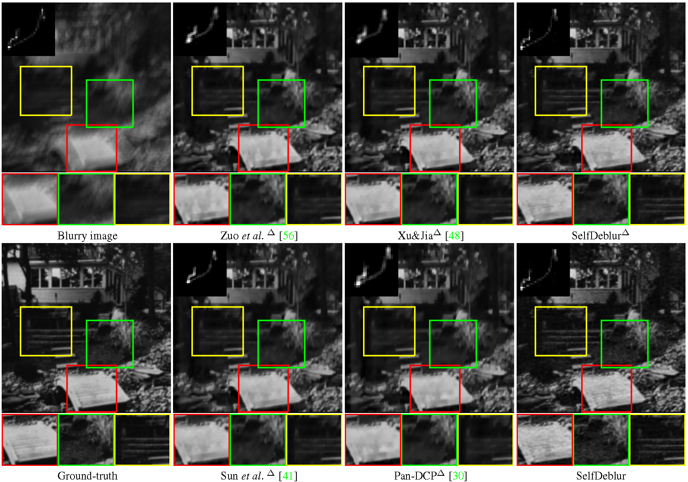
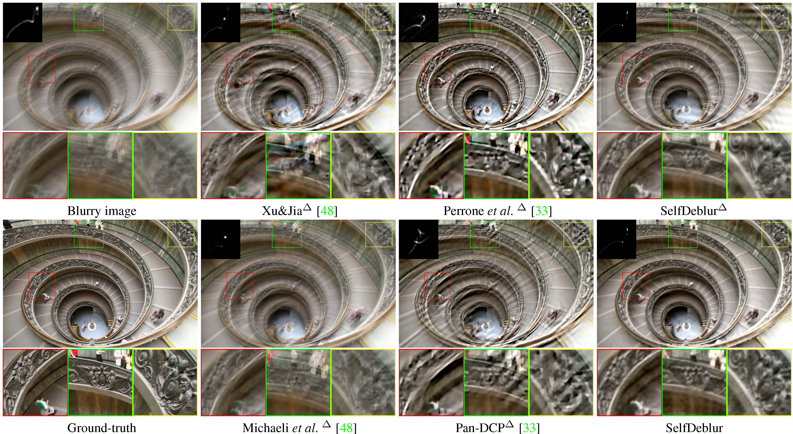

## Neural Blind Deconvolution Using Deep Priors 
[[arxiv]()] [[supp](supplementary/SelfDeblur_supp.pdf)]

### Introduction
Blind deconvolution is a classical yet challenging low-level vision problem with many real-world applications.
Traditional maximum a posterior (MAP) based methods rely heavily on fixed and handcrafted priors that certainly are insufficient in characterizing clean images and blur kernels, and usually adopt specially designed alternating minimization to avoid trivial solution.
In contrast, existing deep motion deblurring networks learn from massive training images the mapping to clean image or blur kernel, but are limited in handling various complex and large size blur kernels.
To connect MAP and deep models, we in this paper present two generative networks for respectively modeling the deep priors of clean image and blur kernel, and propose an unconstrained neural optimization solution to blind deconvolution (SelfDeblur).
Experimental results show that our SelfDeblur can achieve notable quantitative gains as well as more visually plausible deblurring results in comparison to state-of-the-art blind deconvolution methods on benchmark datasets and real-world blurry images.


## Prerequisites
- Python 3.6, PyTorch >= 1.0 
- Requirements: opencv-python, tqdm
- Platforms: Ubuntu 16.04, cuda-10.0 & cuDNN v-7.5
- MATLAB for computing [evaluation metrics](statistic/)


## Datasets

SelfDeblur is evaluated on datasets of Levin et al. [1] and Lai et al. [2]. 
Please download the testing datasets from [BaiduYun]()
or [OneDrive](), 
and place the unzipped folders into `./datasets/`.


## Getting Started

### 1) Run SelfDeblur

We have placed our learned deep models to [BaiduYun]() and [OneDrive](). Please download these models and place the unzipped folders into `./results/`. 

Run shell scripts to deblur:
```bash
bash demo_levin.sh 
bash demo_lai.sh   
```
All the deblurring results are also available at [BaiduYun]() and [OneDrive]().
You can place the downloaded results into `./results/`, and directly compute all the [evaluation metrics](statistic/) in this paper.  

### 2) Evaluation metrics

We also provide the MATLAB scripts to compute the average PSNR and SSIM values reported in the paper.
 

```Matlab
 cd ./statistic
 run statistic_Levin.m
 run statistic_Lai.m
```


SelfDeblur succeeds in simultaneously estimating blur kernel and generating clean image. 

 


## References
[1] A. Levin, Y. Weiss, F. Durand, and W. T. Freeman. Understanding and evaluating blind deconvolution algorithms. In IEEE CVPR 2009. 

[2] W.-S. Lai, J.-B. Huang, Z. Hu, N. Ahuja, and M.-H. Yang. A comparative study for single image blind deblurring. In IEEE CVPR 2016.


